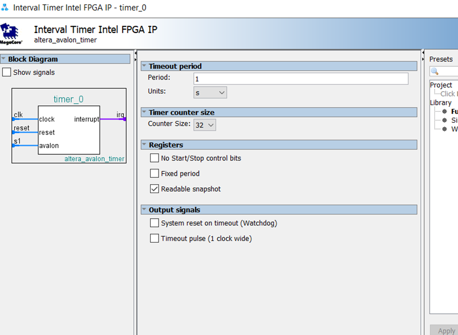
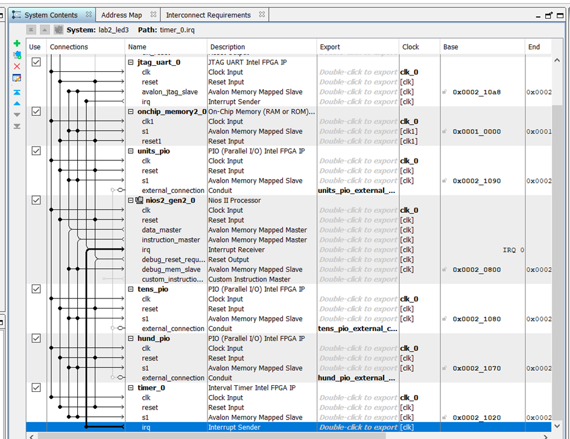

# Lab3 : Timers

Créer un compteur qui s’incrémente chaque seconde avec un timer

1. Ajouter un composant timer à votre design lab2
2. Le timer génère une interruption chaque seconde
3. Écrire la routine d’interruption (ISR)…

------

### Étape 1 : Dans le design QSYS de Lab2, ajouter un composant “Timer”

1. Ouvrir Platform Designer (QSYS)
2. Charger le précédent projet `lab2_led3.qsys`
3. Ajouter un Timer : dans la colonne de gauche ou via la recherche, trouver **`altera_avalon_timer`**. Dans la configuration, définir la période à 1 seconde ( `period = 1, Units = s` ).



**Raccorder l’horloge et le reset**

- Connecter `clk` à l’horloge système et `reset` au reset système.

**Activer l’interruption**

- Dans la fenêtre de configuration du Timer, cocher “Enable Interrupt”.

**Connecter l’IRQ**

- Dans la colonne “Interrupt Sender” / “Interrupt Receiver” de QSYS, relier `irq` du timer au `irq#` du CPU Nios II.

**Attribution d’adresse**

- Dans l’onglet “Address Map”, attribuer une adresse de base à `timer_0`.

**Générer le système**

- Cliquer sur “Generate HDL” ou “Generate” pour produire la sortie (HDL, .sopcinfo, etc.)



------

### Étape 2 : Lancer l’interruption “chaque seconde” via le timer et écrire la routine ISR

En principe, le code dans les fichiers matériels (VHDL/Verilog) ne nécessite pas de modifications particulières pour cette étape.

Vérifier les macros définies dans `system.h` pour le timer
 par exemple :

```c
#define TIMER_0_BASE 0x21020
```

Exemple de code : `lab3.c` :

```c
#include <stdint.h>
#include "system.h"                  
#include "sys/alt_stdio.h"           // alt_printf, alt_putstr 
#include "sys/alt_irq.h"             // alt_irq_register / alt_ic_isr_register
#include <io.h>                      // IOWR_32DIRECT, IORD_32DIRECT
#include "altera_avalon_timer_regs.h"// IOWR_ALTERA_AVALON_TIMER_*
#include "unistd.h"                 

static volatile uint32_t g_sec_count = 0;

static void timer_isr(void *context)
{
    // Remettre le statut du timer à 0 pour effacer l’interruption
    IOWR_ALTERA_AVALON_TIMER_STATUS(TIMER_0_BASE, 0);

    static uint16_t ms_count = 0;
    ms_count++;
    if (ms_count >= 1000) {
        ms_count = 0;
        g_sec_count++;  
    }
}

int main(void)
{
    alt_printf("===== Lab3: Timer Demo Start =====\n");

#ifdef ALT_ENHANCED_INTERRUPT_API_PRESENT
    alt_ic_isr_register(TIMER_0_IRQ_INTERRUPT_CONTROLLER_ID,
                        TIMER_0_IRQ,
                        timer_isr,
                        NULL, 
                        0);
#else
    alt_irq_register(TIMER_0_IRQ, NULL, timer_isr);
#endif

    // Régler la période pour 1ms (0xC350 = 50000d)
    IOWR_ALTERA_AVALON_TIMER_PERIODL(TIMER_0_BASE, 0xC350); 
    IOWR_ALTERA_AVALON_TIMER_PERIODH(TIMER_0_BASE, 0x0000);

    // Démarrer le timer en mode continu avec interruption
    IOWR_ALTERA_AVALON_TIMER_CONTROL(
        TIMER_0_BASE,
        ALTERA_AVALON_TIMER_CONTROL_CONT_MSK |  
        ALTERA_AVALON_TIMER_CONTROL_ITO_MSK  |  
        ALTERA_AVALON_TIMER_CONTROL_START_MSK   
    );

    unsigned int count = 0;
    unsigned int last_sec_val = 0;

    while (1) 
    {
        if (g_sec_count != last_sec_val) {
            last_sec_val = g_sec_count;

            unsigned int value = count;
            unsigned int units = value % 10;
            value /= 10;
            unsigned int tens  = value % 10;
            value /= 10;
            unsigned int hundr = value % 10;

            IOWR_32DIRECT(UNITS_PIO_BASE, 0, units);
            IOWR_32DIRECT(TENS_PIO_BASE,  0, tens);
            IOWR_32DIRECT(HUND_PIO_BASE,  0, hundr);

            count = (count + 1) % 1000;

            alt_printf("Count = %x (hex)\n", count);
        }
    }

    return 0;
}
```

Ainsi, chaque seconde, le timer génère une interruption matérielle.


https://github.com/user-attachments/assets/bcfbc3cb-10fe-46c7-98c7-9a3b48817925

------

### Exemple : générer une interruption toutes les 5 secondes

Pour cela, on peut modifier le code :

```c
if (ms_count >= 5000) {
    ms_count = 0;
    g_sec_count++;
}
```

De cette manière, on accumule **5000 interruptions** (soit 5000 ms = 5 secondes) avant d’incrémenter `g_sec_count`.


https://github.com/user-attachments/assets/f17ca79a-8e65-4070-97be-7ac84b069713

## Conclusion

- **Ce que nous avons appris**

  1. **Ajout d’un timer dans Qsys** : nous avons appris à configurer le composant Altera Avalon Timer (période, activation de l’interruption, attribution d’adresse) et à connecter son IRQ au CPU Nios II.

  2. Configuration de la routine d’interruption (ISR)

     : nous avons vu comment enregistrer l’ISR via 

     ```
     alt_irq_register
     ```

      ou

     ```c
     alt_ic_isr_register(
         TIMER_0_IRQ_INTERRUPT_CONTROLLER_ID,
         TIMER_0_IRQ,
         timer_isr,
         NULL, 
         0
     );
     ```

     puis comment réinitialiser l’état du timer dans l’ISR.

  3. **Événements périodiques** : en ajustant la période du timer (par exemple 1 ms comme unité de base, cumulée pour atteindre 1 seconde ou 5 secondes), nous avons implémenté un comptage cyclique dans le logiciel.

- **Problèmes courants**

  1. **Oubli d’inclure les fichiers d’en-tête** : si l’on écrit du code pour le timer sans ajouter `#include "sys/alt_irq.h"`, on obtient des erreurs de compilation ou d’édition de liens.

  2. Comprendre la lecture et l’écriture des registres du timer

     : il est essentiel de savoir utiliser correctement les macros/fonctions, par exemple :

     ```c
     IOWR_ALTERA_AVALON_TIMER_PERIODL(TIMER_0_BASE, 0xC350); 
     IOWR_ALTERA_AVALON_TIMER_PERIODH(TIMER_0_BASE, 0x0000);
     
     // Démarrer le timer (mode continu + interruption)
     IOWR_ALTERA_AVALON_TIMER_CONTROL(
         TIMER_0_BASE,
         ALTERA_AVALON_TIMER_CONTROL_CONT_MSK |  
         ALTERA_AVALON_TIMER_CONTROL_ITO_MSK  |  
         ALTERA_AVALON_TIMER_CONTROL_START_MSK
     );
     ```

     Une mauvaise configuration peut empêcher le timer de démarrer ou de déclencher l’interruption.

  3. **Gestion des interruptions** : oublier de réinitialiser le registre d’état du timer dans l’ISR ou ne pas activer correctement les interruptions à la fois dans Qsys et dans le logiciel peut entraîner un blocage du système ou la perte d’interruptions.

- **Solutions et améliorations**

  1. **Intégration soignée dans Qsys** : lors de l’ajout de nouveaux composants, vérifier les connexions clock/réinitialisation, les mappings d’interruptions et l’attribution des adresses.
  2. **Inclure correctement les en-têtes** : pour toute fonctionnalité liée au timer, ajouter `#include "sys/alt_irq.h"`, sinon les API pour enregistrer les fonctions ISR ne seront pas reconnues.
  3. **ISR concis** : dans l’ISR, ne faire que le strict nécessaire (effacer l’interruption, mettre à jour les compteurs), et placer les opérations plus longues (par ex. impression de messages) dans la boucle principale.
  4. **Ajustement flexible de la période** : en modifiant les registres `PERIODL`/`PERIODH` et le registre de contrôle, on peut facilement changer la précision de comptage et le mode d’interruption du timer.
